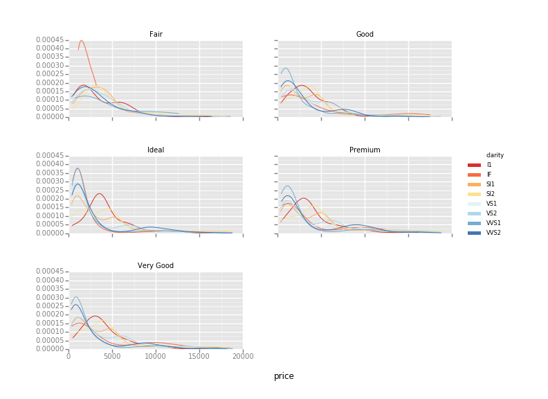

# ggplot
## _Introduction_

### What is ggplot?
`ggplot` is a Python implementation of the grammar of graphics. It is not intended
to be a feature-for-feature port of [`ggplot2 for R`](https://github.com/hadley/ggplot2)--though 
there is much greatness in `ggplot2`, the Python world could stand to benefit 
from it. So there __will be feature overlap__, but not neccessarily mimicry 
(after all, R is a little weird).

**For Example**

You can do things like
```python
ggplot(diamonds, aes(x='price', color='clarity')) + \
    geom_density() + \
    scale_color_brewer(type='div', palette=7) + \
    facet_wrap('cut')
```



**Example Dataset**
```r
library(ggplot2)
str(mpg)
```

```
'data.frame':	234 obs. of  11 variables:
 $ manufacturer: Factor w/ 15 levels "audi","benz",..: 1 1 1 1 1 1 1 1 1 1 ...
 $ model       : Factor w/ 38 levels "4runner 4wd",..: 2 2 2 2 2 2 2 3 3 3 ...
 $ displ       : num  1.8 1.8 2 2 2.8 2.8 3.1 1.8 1.8 2 ...
 $ year        : int  1999 1999 2008 2008 1999 1999 2008 1999 1999 2008 ...
 $ cyl         : int  4 4 4 4 6 6 6 4 4 4 ...
 $ trans       : Factor w/ 10 levels "auto(av)","auto(l3)",..: 4 9 10 1 4 9 1 9 4 10 ...
 $ drv         : Factor w/ 3 levels "4","f","r": 2 2 2 2 2 2 2 1 1 1 ...
 $ cty         : int  18 21 20 21 16 18 18 18 16 20 ...
 $ hwy         : int  29 29 31 30 26 26 27 26 25 28 ...
 $ fl          : Factor w/ 5 levels "c","d","e","p",..: 4 4 4 4 4 4 4 4 4 4 ...
 $ class       : Factor w/ 7 levels "2seater","compact",..: 2 2 2 2 2 2 2 2 2 2 ...
```
---
## ggplot2 “Hello, world!”

```r
qplot(displ, hwy, data = mpg)
```


### Installation
```bash
$ pip install -U ggplot
# or 
$ conda install -c conda-forge ggplot
```

## Basic building blocks according to the grammar of graphics:

- **data** The data + a set of aesthetic mappings that describing variables mapping
- **geom** Geometric objects, represent what you actually see on the plot: points, lines, polygons, etc.
stats Statistical transformations, summarise data in many useful ways.
- **stats** Statistical transformations, summarise data in many useful ways.
- **scale** The scales map values in the data space to values in an aesthetic space
- **cord** A coordinate system, describes how data coordinates are mapped to the plane of the graphic
- **facet** A faceting specification describes how to break up the data into subsets for plotting individual set

## Plotting in ggplot style
Let's set up our working environment with necessary libraries and also load our csv file into data frame called ` survs_df ` ,
```
import numpy as np
import pandas as pd
from plotnine import *

%matplotlib inline
survs_df = pd.read_csv('surveys.csv').dropna()
```
To produce a plot with the `ggplot` class from `plotnine`, we must provide three things:

- A data frame containing our data.
- How the columns of the data frame can be translated into positions, colors, sizes, and shapes of graphical elements ("aesthetics").
- The actual graphical elements to display ("geometric objects").


